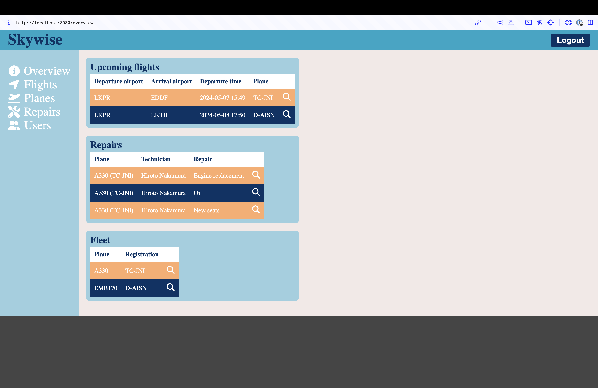

# Airline information system

## Table of content
 - [Installation](#installation)
 - [Specification](#specification)

## Installation
1. Fill in env based on `.env.example`
2. `mvn clean install`
3. `mvn spring-boot:run`
**Can be used FOR SIMULATION FLIGHTS ONLY!**

## Specification

system roles:
 - admin
 - planner
 - pilot
 - flight attendant(FA)
 - technician

system can:
- save planes in airline
- save staff names and their roles
- admin
  - can add pilots, flight attendants and technicians
- planner
  - can add new flights
- pilot briefing
  - loged in pilot can look at his flights
  - check metar at airports
  - see flight plan
- FA
  - can see gate and departure time(same for arrival)
- technician
  - can log aircraft repair

Tech stack:
- Java Spring Boot
- Thymeleaf

Used api:
- [METAR from airports](https://flightplandatabase.com/dev/api)